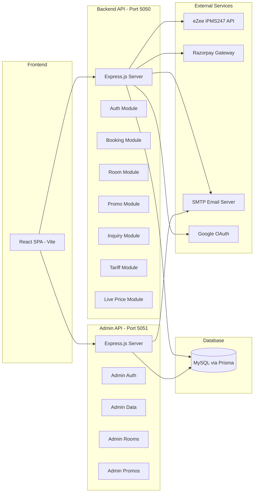

# 01 — Project Overview

## Purpose

**Vintage Valley Spa Resort** is a full-stack hotel booking platform built for a real spa resort property. It enables guests to browse rooms with live pricing from the hotel's Property Management System (eZee Absolute / iPMS247), make bookings with Razorpay payments, and receive automated email confirmations with PDF invoices. Staff and administrators manage bookings, users, promo codes, tariffs, and inquiries through a built-in admin panel.

## Problem Solved

The platform replaces the need for third-party booking aggregators by providing a direct-booking channel that:

1. Fetches **real-time room availability and pricing** from eZee PMS.
2. Supports **multiple meal plans** (EP, CP, MAP) with per-night selection.
3. Processes **online payments** via Razorpay with signature verification.
4. Automatically **pushes confirmed bookings back to eZee PMS** for inventory management.
5. Sends **email confirmations with PDF invoices** to both guest and hotel owner.
6. Allows **staff/admin manual bookings** for walk-in guests (offline payments).
7. Supports **promotional codes and global flat discounts** with advanced rules.

## Target Users

| Role | Description |
|------|-------------|
| **Guest (USER)** | End customers browsing rooms, booking, and paying online |
| **Staff (STAFF)** | Hotel staff creating manual bookings for walk-in guests |
| **Admin (ADMIN)** | Hotel managers with full access to all management features |

## Main Features

### Guest-Facing
- **Room Browsing** — Live eZee prices with fallback to database/static prices
- **Room Detail Pages** — Multiple image gallery, amenities, meal plan selection
- **Booking Flow** — Date picker, guest count, meal plan per night, promo codes
- **Razorpay Payments** — Secure online payment with retry capability
- **User Profile** — View bookings, download invoices, update profile
- **Google OAuth** — One-click sign-in via Google
- **Contact Form** — Submit inquiries to the hotel
- **Tariff Card** — View published weekday/weekend pricing
- **Attractions & Gallery** — Discover nearby attractions and resort photos

### Admin / Staff
- **Dashboard** — Overview of rooms and pricing from database
- **Booking Management** — View all bookings, create manual bookings, delete bookings
- **User Management** — View registered users
- **Payment Management** — View payment details with Razorpay enrichment
- **Promo Code Management** — Create/edit/delete code-based and global flat promos
- **Inquiry Management** — View and mark-read guest inquiries
- **Tariff Management** — Edit published room tariffs
- **Room Management** — View and update room details, images, amenities (Admin API)

## User Roles

```
ADMIN — Full access to all admin features + booking management + eZee operations
STAFF — Access to booking management, inquiries, promos, tariff (same as admin in practice)
USER  — Browse rooms, book, pay, view own bookings, manage profile
```

## Technology Stack

| Category | Technology | Version |
|----------|-----------|---------|
| **Frontend Framework** | React | 18.3.x |
| **Frontend Build Tool** | Vite | 5.4.x |
| **Frontend Language** | TypeScript | 5.5.x |
| **UI Components** | shadcn/ui (Radix UI primitives) | Latest |
| **Styling** | TailwindCSS | 3.4.x |
| **State / Fetching** | TanStack React Query | 5.56.x |
| **Routing** | React Router DOM | 6.30.x |
| **Charts** | Recharts | 2.12.x |
| **Backend Runtime** | Node.js + Express.js | 4.19.x |
| **Backend Language** | TypeScript | 5.5.x |
| **ORM** | Prisma | 5.17.x / 5.22.x |
| **Database** | MySQL | — |
| **Payment Gateway** | Razorpay | 2.9.x |
| **PMS Integration** | eZee Absolute (iPMS247 API) | REST |
| **Email** | Nodemailer (SMTP / Gmail) | 6.9.x / 8.x |
| **PDF Generation** | jsPDF | 2.5.x |
| **Authentication** | JSON Web Tokens (jsonwebtoken) | 9.0.x |
| **Password Hashing** | bcryptjs | 2.4.x |
| **Validation** | Zod | 3.23.x |
| **HTTP Client** | Axios | 1.7.x |
| **Rate Limiting** | express-rate-limit | 7.4.x |
| **Process Manager** | PM2 | — |
| **Web Server** | Nginx | — |

## Major Modules



## Overall Application Workflow

1. **Guest visits** the frontend SPA (served by Nginx in production).
2. **Room listing** fetches live prices from eZee API → falls back to cache → falls back to static data.
3. **Guest signs up / logs in** (email+password or Google OAuth) → JWT issued in HTTP-only cookie.
4. **Guest selects room, dates, meal plan, guests** → promo code validated → price calculated.
5. **Razorpay order created** → guest pays → Razorpay signature verified.
6. **Booking pushed to eZee PMS** via `InsertBooking` API → inventory updated.
7. **Booking confirmed in DB** → email sent with PDF invoice to guest + hotel owner.
8. **Admin/Staff** can create manual bookings for walk-in guests → eZee + email notification.
9. **Admin panel** provides management dashboards for bookings, users, payments, promos, inquiries, and tariffs.
