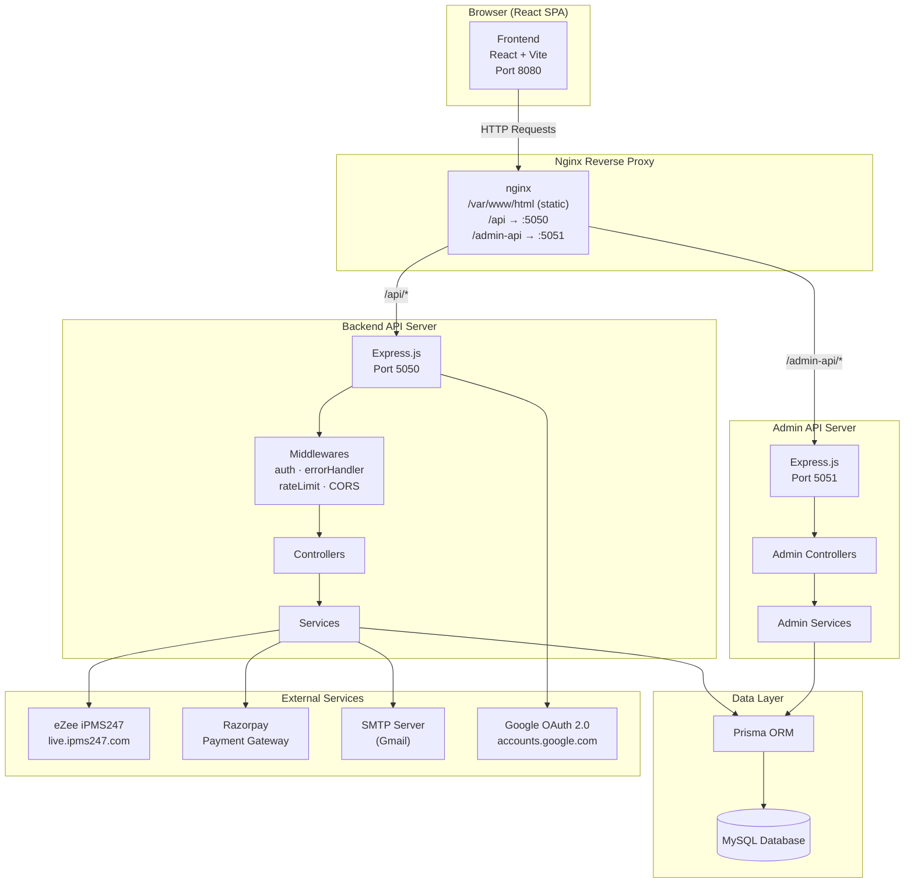
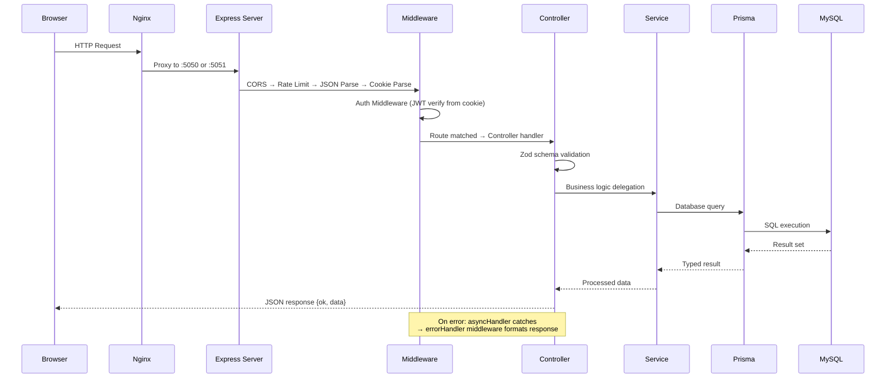
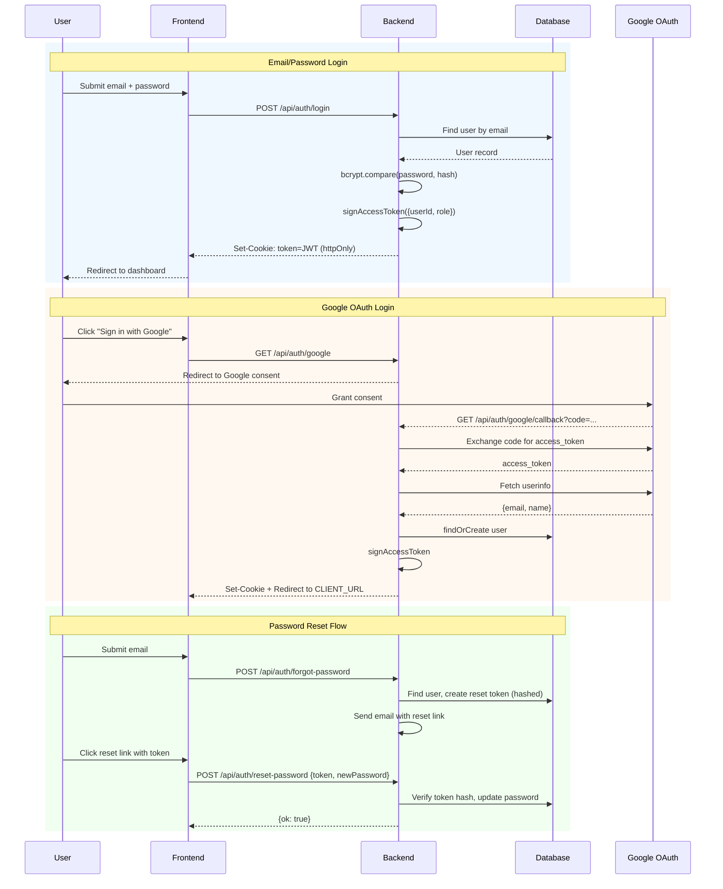
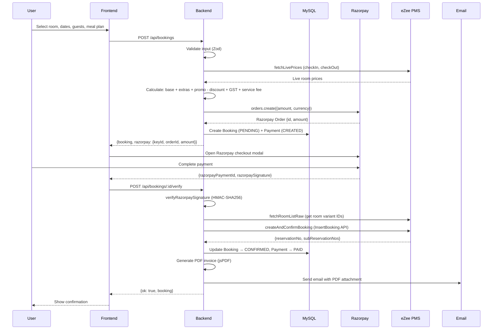
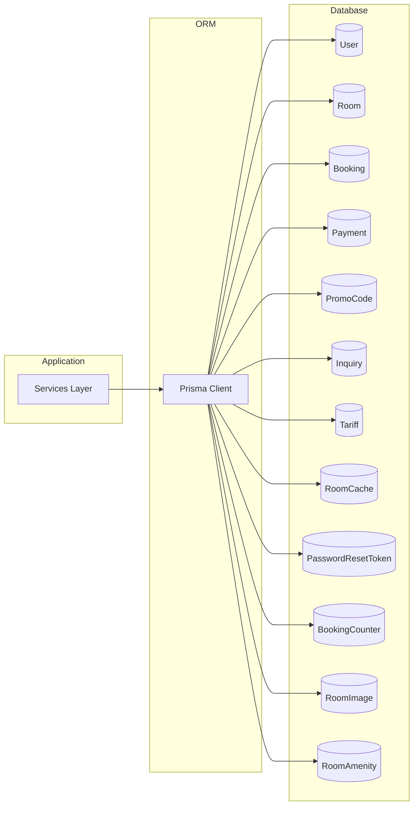
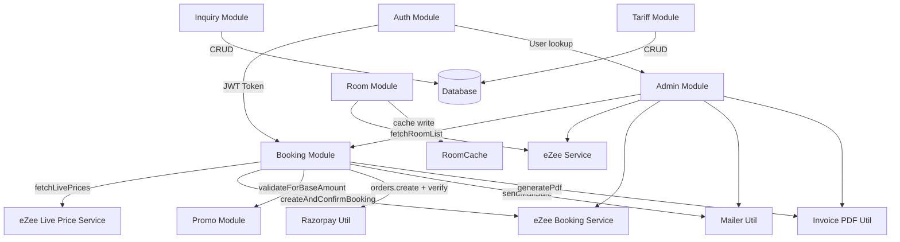
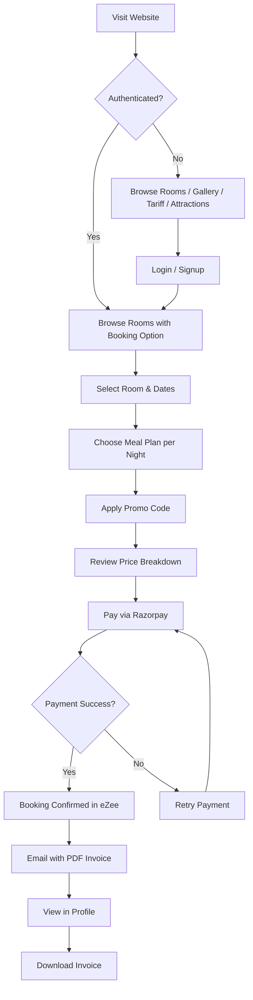
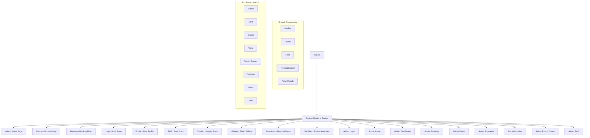
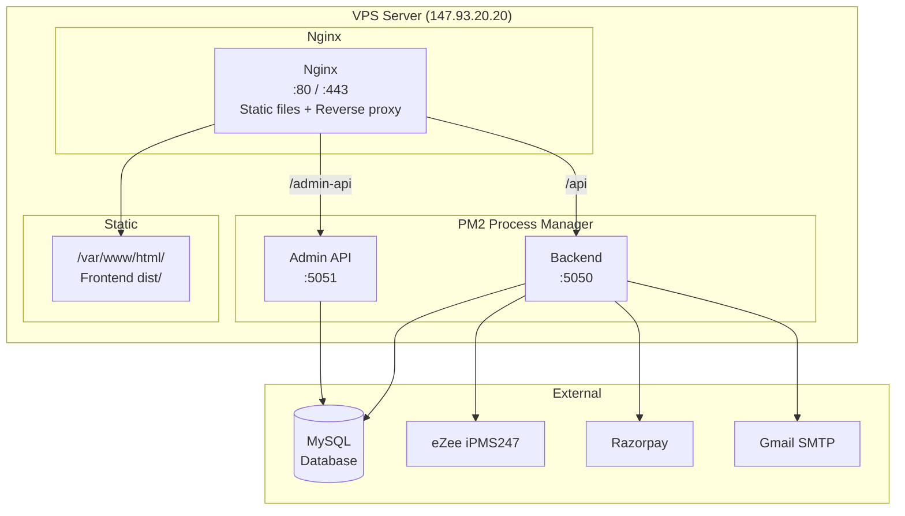

# 02 — System Architecture

## High-Level Architecture

## Request Flow

## Authentication Flow

## Booking & Payment Flow

## Database Interaction

## Module Interaction

## User Journey

## Component Relationship (Frontend)

## Deployment Architecture

