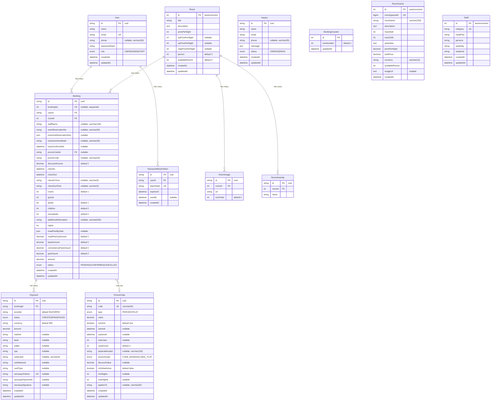

# 06 — Database Documentation

## Overview

The database is **MySQL**, accessed through **Prisma ORM**. The schema is defined in `Backend/prisma/schema.prisma` and contains **12 models** with **6 enums**.

## ER Diagram



---

## Enums

| Enum | Values | Used In |
|------|--------|---------|
| `Role` | `USER`, `ADMIN`, `STAFF` | `User.role` |
| `PromoScope` | `CODE_BASED`, `GLOBAL_FLAT` | `PromoCode.promoScope` |
| `BookingStatus` | `PENDING`, `CONFIRMED`, `CANCELLED` | `Booking.status` |
| `PaymentStatus` | `CREATED`, `PAID`, `FAILED` | `Payment.status` |
| `InquiryStatus` | `UNREAD`, `READ` | `Inquiry.status` |
| `PromoDiscountType` | `PERCENT`, `FLAT` | `PromoCode.type` |

---

## Detailed Model Documentation

### User

**Purpose**: Stores registered users — guests, staff, and admins.

| Column | Type | Constraints | Purpose |
|--------|------|-------------|---------|
| `id` | String (cuid) | PK | Unique identifier |
| `name` | String | NOT NULL | Display name |
| `email` | String | UNIQUE, NOT NULL | Login identifier |
| `phone` | VarChar(30) | Nullable | Contact number |
| `passwordHash` | String | NOT NULL | bcrypt hash (cost 10) |
| `role` | Enum(Role) | Default: USER | Access level |
| `createdAt` | DateTime | Auto | Registration time |
| `updatedAt` | DateTime | Auto | Last update |

**Indexes**: `role`  
**Relationships**: → Booking (1:N), → PasswordResetToken (1:N)  
**Business Rules**: Email must be unique. Google OAuth users get a random password hash. Admin role set via seed or direct DB update.

---

### Room

**Purpose**: Stores hotel room types with base pricing and capacity.

| Column | Type | Constraints | Purpose |
|--------|------|-------------|---------|
| `id` | Int | PK, Auto | Room type identifier |
| `title` | String | NOT NULL | Room type name (e.g., "Deluxe Studio Suite") |
| `description` | Text | NOT NULL | Room description |
| `pricePerNight` | Int | NOT NULL | Base price (EP, weekday) |
| `epPricePerNight` | Int | Nullable | EP plan per-night addon |
| `cpPricePerNight` | Int | Nullable | CP plan per-night addon |
| `mapPricePerNight` | Int | Nullable | MAP plan per-night addon |
| `person` | Int | Default: 2 | Base occupancy |
| `availableRooms` | Int | Default: 0 | Synced from eZee |

**Relationships**: → RoomImage (1:N), → RoomAmenity (1:N), → Booking (1:N)  
**Seeded Data**: 4 room types — IDs 1, 3, 4, 5

---

### Booking

**Purpose**: Core booking record linking user, room, payment, and eZee PMS data.

| Column | Type | Purpose |
|--------|------|---------|
| `bookingNo` | Int (nullable, unique) | Sequential human-readable ID (VVR-1, VVR-2, ...) |
| `staffName` | VarChar(100) | Staff who created manual booking |
| `ezeeReservationNo` | VarChar(50) | eZee PMS reservation number |
| `ezeeSubReservationNos` | JSON | Array of sub-reservation numbers (multi-room) |
| `ezeeInventoryMode` | VarChar(30) | eZee inventory allocation mode |
| `mealPlanByDate` | JSON | `[{date: "2026-01-01", plan: "CP"}, ...]` |
| `baseAmount` | Decimal(10,2) | Subtotal after discount, before tax |
| `convenienceFeeAmount` | Decimal(10,2) | 2% service fee |
| `gstAmount` | Decimal(10,2) | 5% GST |
| `amount` | Decimal(10,2) | Final total charged |

**Indexes**: `userId`, `roomId`  
**Cascade**: Delete user → delete bookings. Delete room → RESTRICT (prevent).

---

### Payment

**Purpose**: Payment records linked to bookings. Supports both online (Razorpay) and offline (CASH/UPI/CARD).

| Column | Purpose |
|--------|---------|
| `provider` | `"RAZORPAY"` or `"OFFLINE"` |
| `method` | Payment method: `upi`, `card`, `netbanking`, `CASH`, etc. |
| `razorpayOrderId` | Unique Razorpay order ID |
| `razorpayPaymentId` | Razorpay payment ID (after payment) |
| `razorpaySignature` | HMAC-SHA256 signature for verification |
| `cardLast4` / `cardNetwork` / `cardType` | Card details (fetched from Razorpay post-payment) |

**Cascade**: Delete booking → delete payments.

---

### PromoCode

**Purpose**: Promotional discount codes with two scopes — code-based and global flat.

| Feature | Code-Based | Global Flat |
|---------|-----------|-------------|
| `promoScope` | `CODE_BASED` | `GLOBAL_FLAT` |
| User enters code? | Yes | No — applied automatically |
| `isGlobalActive` | N/A | Only one active at a time |
| `type` | PERCENT or FLAT | Always FLAT |
| Stay duration rules | `minNights`, `maxNights`, `appliesTo` | N/A |
| Weekend-only | Via `applicableLabel` / `appliesTo` | N/A |

---

### RoomCache

**Purpose**: Caches eZee room data to serve as fallback when eZee API is unavailable.

**Table name**: `rooms_cache` (mapped via `@@map`)  
**Updated by**: `roomController.list` — upserts on every successful eZee API call.

---

### BookingCounter

**Purpose**: Single-row counter for generating sequential booking numbers.

**Row**: Always `id=1` with `nextNumber` incrementing via `allocateNextBookingNo()`.

---

### Tariff

**Purpose**: Published pricing card shown on the tariff page.

**Seeded defaults**: 4 room categories with weekday/weekend pricing and meal plan info.

---

## Database Seed

The seed script (`prisma/seed.js`) performs:

1. **Admin User Creation**: Creates or updates a user with `ADMIN` role using `ADMIN_EMAIL` / `ADMIN_PASSWORD` from env.
2. **Room Upsert**: Creates 4 room types with images and amenities. On re-run, deletes and recreates images/amenities.

```bash
npx prisma db seed
```
