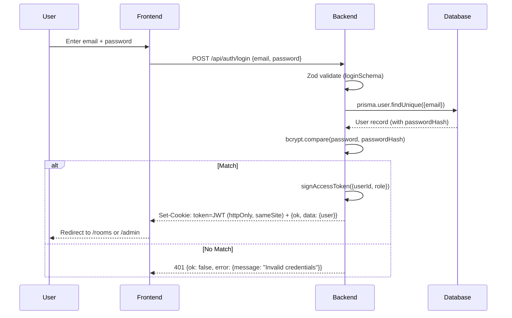
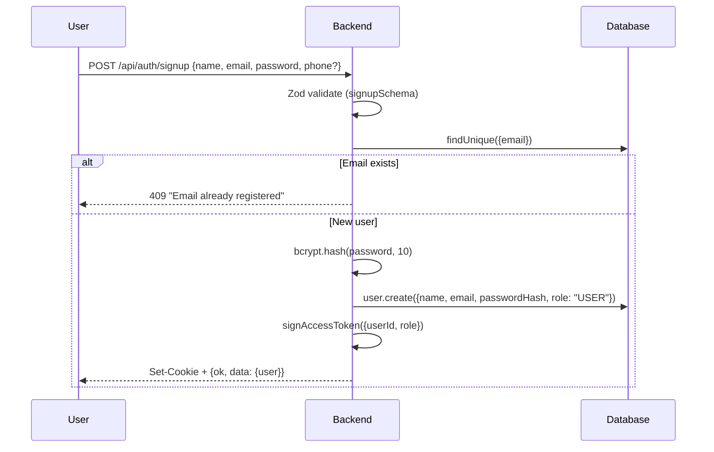
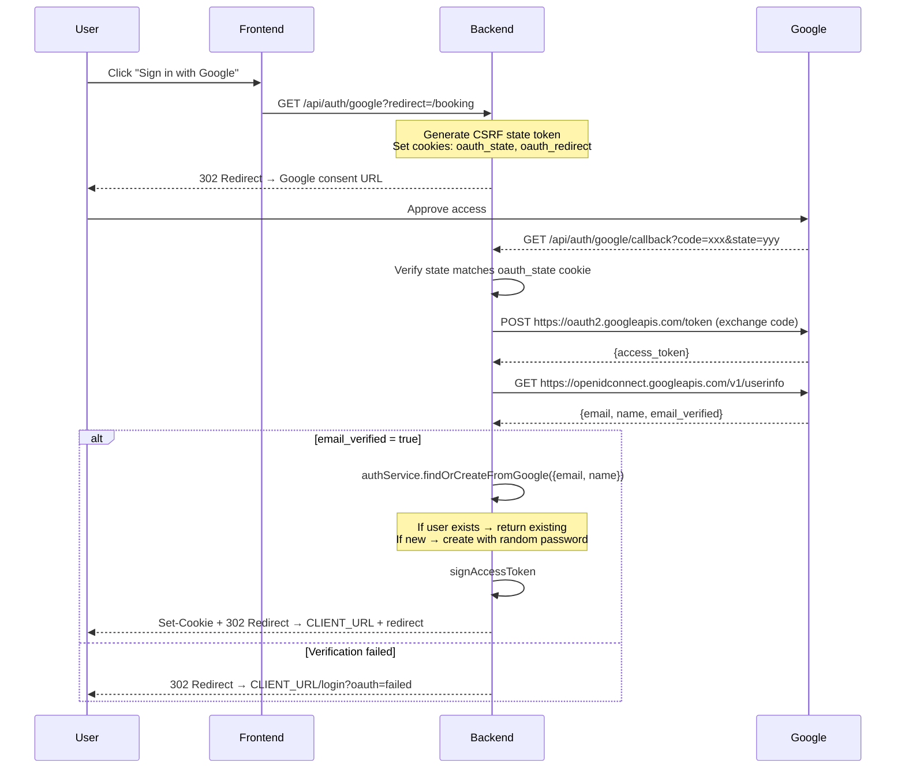
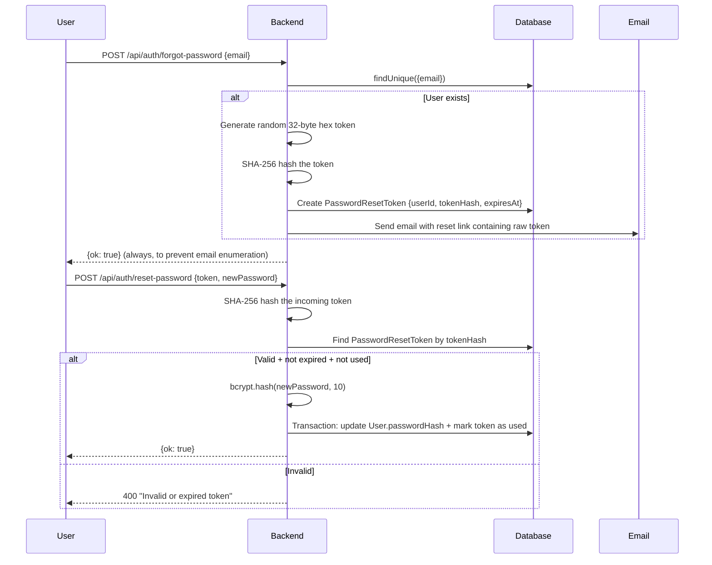

# 08 — Authentication

## Overview

Authentication uses **JWT (JSON Web Tokens)** stored in **HTTP-only cookies**. Three login methods are supported: email/password, Google OAuth 2.0, and admin-specific login (same mechanism, different UI flow).

---

## Login Flow



### JWT Payload

```typescript
type JwtPayload = {
  userId: string;   // User.id (cuid)
  role: "USER" | "ADMIN" | "STAFF";
};
```

### JWT Configuration

| Setting | Source | Default |
|---------|--------|---------|
| Secret | `env.JWT_SECRET` | — (required, min 16 chars) |
| Expiration | `env.JWT_EXPIRES_IN` | `7d` |
| Algorithm | jsonwebtoken default | HS256 |

---

## Registration Flow



**Password hashing**: bcrypt with cost factor 10. The hash is stored in `User.passwordHash`.

---

## Google OAuth 2.0 Flow



### Security Measures

- **CSRF Protection**: Random `state` token stored in cookie, verified on callback
- **Email Verification**: Only accepts `email_verified: true` from Google
- **Safe Redirect**: Only accepts redirect paths starting with `/`
- **Cookie TTL**: OAuth state cookies expire after 10 minutes

### Google OAuth Users

- Created with `role: USER` (cannot be admin via OAuth)
- Get a random 32-byte hex password hash (cannot login with password unless reset)
- Name defaults to Google profile name or "Guest"

---

## JWT Cookie Configuration

Defined in `Backend/src/utils/cookies.ts`:

```typescript
const getAuthCookieOptions = (): CookieOptions => {
  const isProd = env.NODE_ENV === "production";
  return {
    httpOnly: true,          // Not accessible via JavaScript
    sameSite: isProd ? "none" : "lax",  // Cross-site in prod (for separate frontend domain)
    secure: env.COOKIE_SECURE || isProd, // HTTPS only in production
    path: "/",               // Available on all routes
  };
};
```

| Property | Development | Production |
|----------|------------|------------|
| `httpOnly` | `true` | `true` |
| `sameSite` | `lax` | `none` |
| `secure` | `false` | `true` |

---

## Password Reset Flow



### Security Details

- **Token storage**: Only the SHA-256 hash is stored in the database (raw token sent via email)
- **Expiration**: Configurable via `RESET_TOKEN_EXPIRES_MINUTES` (default 30 min)
- **Single use**: `usedAt` field prevents token reuse
- **Indexes**: `tokenHash` (unique), `userId`, `expiresAt` for fast lookups

---

## Logout Flow

Simply clears the JWT cookie:

```typescript
const clearAuthCookie = (res: Response) => {
  res.clearCookie(env.JWT_COOKIE_NAME, { path: "/" });
};
```

No server-side token blacklist exists — JWT remains valid until expiration. This is a known trade-off for simplicity.

---

## Profile Update

Authenticated users can update their name, phone, and password:

```typescript
const updateProfileSchema = z.object({
  name: z.string().min(1).optional(),
  phone: z.string().optional(),
  password: z.string().min(6).optional(),
});
```

If `password` is provided, it's re-hashed with bcrypt before storage.
