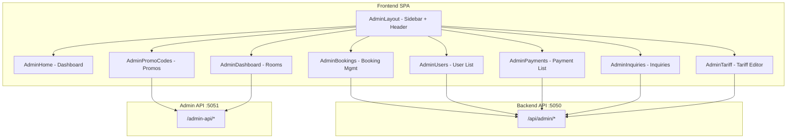

# 12 — Admin Panel

## Overview

The admin panel is split across two layers:

1. **Admin API** (`Admin/` directory, port 5051) — A separate Express.js server providing admin-specific endpoints under `/admin-api`.
2. **Admin Frontend** (inside `Frontend/src/pages/Admin*.tsx`) — React pages rendered within the same SPA, using the `AdminLayout` wrapper component.

---

## Architecture

---

## Admin API Server (`Admin/`)

### Entry Point
- `Admin/src/index.ts` loads environment via `preloadEnv.ts`, creates the Express app, listens on `ADMIN_PORT` (default 5051).

### Environment Loading (`preloadEnv.ts`)
Searches for `.env` file in this priority order:
1. `Backend/.env`
2. `Backend/env`
3. `Backend/env (1)`
4. `Admin/.env`
5. `Admin/env`
6. Various `.env.example` fallbacks

This ensures the Admin server shares the same database and API credentials as the Backend.

### Route Structure

| Route Group | Middleware | Purpose |
|-------------|-----------|---------|
| `/admin-api/auth/*` | None | Login, signup, me, forgot/reset password |
| `/admin-api/*` (data) | `requireAuth` | Bookings, users, rooms listing |
| `/admin-api/promos/*` | `requireAuth` + `requireAdminOrStaff` | Promo CRUD |
| `/admin-api/rooms/*` | `requireAuth` + `requireAdminOrStaff` | Room updates |

### Controllers

#### `adminAuthController.ts`
- `POST /auth/login` — Validates credentials, returns JWT cookie
- `POST /auth/signup` — Creates ADMIN/STAFF user (requires admin approval in practice)
- `GET /auth/me` — Returns current admin user
- `POST /auth/forgot-password` — Sends reset email to hotel owner
- `POST /auth/reset-password` — Resets password with token

#### `adminDataController.ts`
- `GET /bookings` — Lists all bookings with user, room, payment relations
- `GET /users` — Lists all users
- `GET /rooms` — Lists all rooms with images and amenities
- `DELETE /bookings/:id` — Deletes a booking

#### `adminRoomController.ts`
- `PUT /rooms/:id` — Updates room title, description, pricing (EP/CP/MAP), images, amenities
- Supports updating `pricePerNight`, `epPricePerNight`, `cpPricePerNight`, `mapPricePerNight`
- Replaces images and amenities arrays on update

#### `adminPromoController.ts`
- `GET /promos` — Lists all promos (both CODE_BASED and GLOBAL_FLAT)
- `POST /promos` — Creates a new promo
- `PATCH /promos/:id` — Updates promo settings
- `DELETE /promos/:id` — Deletes a promo

### Services

#### `adminAuthService.ts` (9K)
- `login({email, password})` — bcrypt compare + role check (ADMIN or STAFF)
- `signup({name, email, password, role})` — Creates user with specified role
- `me(userId)` — Returns user data
- `createResetToken(email)` — SHA-256 hashed reset token
- `resetPassword({token, newPassword})` — Transactional token verify + password update
- Sends reset emails to `vintagevalleyresort@gmail.com` (hardcoded hotel owner email)

#### `adminDataService.ts` (2K)
- `listBookings()` — Includes user, room, payments relations
- `listUsers()` — Select id, name, email, phone, role, timestamps
- `listRooms()` — Includes images (sorted), amenities
- `deleteBooking(id)` — Direct delete

#### `adminRoomService.ts` (6K)
- `updateRoom(id, data)` — Transactional update of room + images + amenities
- Handles image URL cleanup and re-ordering
- Supports per-meal-plan pricing updates

#### `adminPromoService.ts` (5K)
- Full CRUD for both CODE_BASED and GLOBAL_FLAT scopes
- `toggleGlobalActive(id, isActive)` — Ensures only one GLOBAL_FLAT promo is active
- Normalizes code to uppercase

---

## Admin Frontend Pages

### `AdminHome.tsx` — Dashboard Overview
- Displays navigation cards to all admin sections
- Shows count badges (e.g., new bookings, unread inquiries)
- Quick access to all management modules

### `AdminDashboard.tsx` — Room Management
- Lists all rooms from database
- Shows room details, pricing, images
- Links to room edit (via Admin API)

### `AdminBookings.tsx` (86K — Most Complex Page)
**Features**:
- **Booking Table**: Sortable, searchable list of all bookings
- **Filters**: By status (PENDING/CONFIRMED/CANCELLED), date range, search text
- **Manual Booking Form**: Full form for walk-in guests
  - User selection (existing or new)
  - Room selection
  - Date picker (check-in/check-out, custom times)
  - Guest count (adults, children, extra adults)
  - Per-night meal plan selection (EP/CP/MAP calendar)
  - Promo code application
  - Payment method (CASH/UPI/CARD)
  - Amount override option
  - Price breakdown preview
- **Booking Detail Modal**: Full booking information with payment details
- **Delete Booking**: Confirmation dialog for booking deletion
- **New Bookings Badge**: Polls for new bookings count

### `AdminUsers.tsx` — User Management
- Table of all registered users
- Columns: name, email, phone, role, registration date
- Search functionality

### `AdminPayments.tsx` — Payment Management
- Lists all payments across bookings
- Shows payment method, status, amount, provider
- Razorpay payment details (card last 4, network, VPA, etc.)
- Method enrichment from Razorpay API (lazy-loaded)

### `AdminInquiries.tsx` — Inquiry Management
- Lists guest inquiries from contact form
- Unread/Read status toggle
- Mark as read functionality
- Unread count badge

### `AdminPromoCodes.tsx` — Promo Code Management
- **Code-Based Promos**: Create/edit/delete promo codes
  - Type: PERCENT or FLAT
  - Value, active status, date range
  - Max uses, min/max nights, weekend rules
  - Applicable label
- **Global Flat Promos**: Flat discount applied to all bookings
  - Only one active at a time
  - Separate section in UI

### `AdminTariff.tsx` — Tariff Management
- Editable tariff table
- Columns: category, meal plan, persons, weekday price, weekend price
- Inline editing with save

---

## Admin Layout Component (`AdminLayout.tsx`)

Wraps all admin pages with:
- **Sidebar**: Navigation links to all admin sections with icons
- **Header**: Admin title, user info, logout button
- **Auth Check**: Fetches `/api/auth/me` on mount, redirects to `/admin/login` if not authenticated
- **Responsive**: Collapsible sidebar on mobile

Sidebar navigation items:
| Label | Path | Icon |
|-------|------|------|
| Dashboard | `/admin` | Home |
| Rooms | `/admin/rooms` | Bed |
| Bookings | `/admin/bookings` | Calendar |
| Users | `/admin/users` | Users |
| Payments | `/admin/payments` | CreditCard |
| Inquiries | `/admin/inquiries` | MessageSquare |
| Promo Codes | `/admin/promos` | Tag |
| Tariff | `/admin/tariff` | DollarSign |

---

## Key Differences: Admin API vs Backend Admin Routes

The project has **two** sets of admin endpoints:

| Feature | Backend `/api/admin/*` | Admin `/admin-api/*` |
|---------|----------------------|---------------------|
| Server | Port 5050 | Port 5051 |
| Booking creation | Manual booking with eZee push | N/A |
| Room CRUD | List only | Full update |
| Promo CRUD | Basic CRUD | CRUD + global flat |
| Auth | Reuses main auth | Dedicated admin auth service |
| Shared code | Own middlewares | Imports Backend middlewares |

Both connect to the same MySQL database via Prisma.
