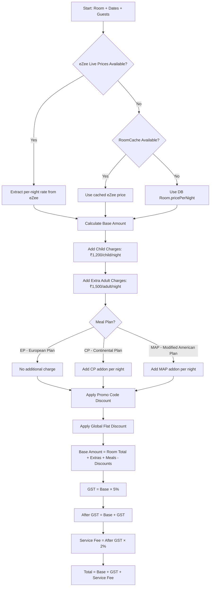
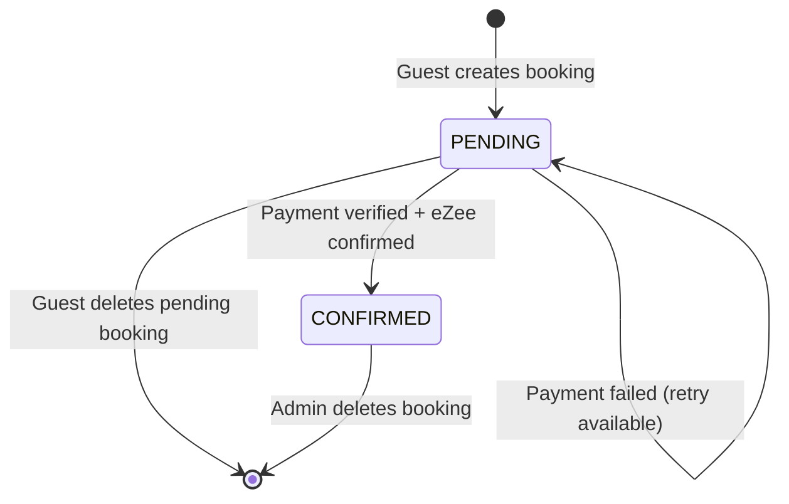
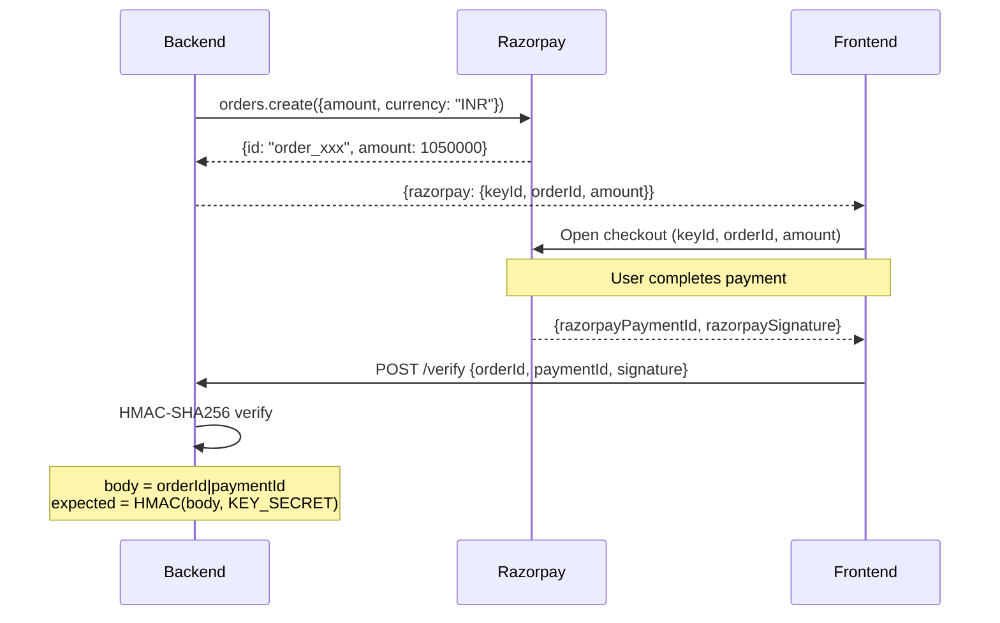

# 13 — Business Logic

## Pricing Engine

### Price Calculation Flow



### Price Extraction Priority (from eZee)

The `extractPricePerNight()` function in `roomController.ts` checks these fields in order:

| Priority | Field | Source |
|----------|-------|--------|
| 1 | `day_wise_beforediscount` | Per-night breakdown object |
| 2 | `avg_per_night_after_discount` | Pre-calculated average |
| 3 | `totalprice_inclusive_all / nights` | Total divided by nights |
| 4 | `exclusive_tax` (object values) | Tax-exclusive rates |
| 5 | `rack_rate` | Published rack rate |
| 6 | `avg_price_per_night` | Cleaned average from ezee.service |
| 7 | Database `pricePerNight` | Local fallback |

### Meal Plan Pricing

| Plan | Code | Description | Pricing Logic |
|------|------|-------------|---------------|
| **EP** | European Plan | Room only, no meals | Base room rate |
| **CP** | Continental Plan | Room + breakfast | Base + `cpPricePerNight` addon |
| **MAP** | Modified American Plan | Room + breakfast + dinner | Base + `mapPricePerNight` addon |

Per-night meal plan selection is stored as JSON in `Booking.mealPlanByDate`:

```json
[
  { "date": "2026-08-01", "plan": "EP" },
  { "date": "2026-08-02", "plan": "CP" },
  { "date": "2026-08-03", "plan": "MAP" }
]
```

### MAP Pricing Fallback (Admin Manual Bookings)

When `mapPricePerNight` is not set in the Room record, the admin service uses a title-based rate:

```typescript
const mapRatePerGuestPerNight =
  title.includes("lotus") || title.includes("presidential") ? 2000 :
  title.includes("deluxe") || title.includes("edge") ? 1000 :
  0;
```

### Tax and Fee Structure

| Component | Rate | Calculation |
|-----------|------|-------------|
| **GST** | 5% | `baseAmount × 0.05` |
| **Service Fee** | 2% | `(baseAmount + GST) × 0.02` |
| **Total** | — | `baseAmount + GST + serviceFee` |

---

## Booking System

### Online Booking (Guest)



**Steps**:
1. Guest selects room, dates, guests, meal plans
2. Frontend sends `POST /api/bookings/`
3. Backend: validate → fetch eZee prices → match room type → calculate price → apply promo → create Razorpay order → save PENDING booking + CREATED payment
4. Frontend opens Razorpay checkout modal
5. Guest completes payment
6. Frontend sends `POST /api/bookings/:id/verify`
7. Backend: verify signature → fetch raw eZee rooms → find EP/CP/MAP variant → push InsertBooking to eZee → update CONFIRMED + PAID → generate PDF → send email

### Manual Booking (Admin/Staff)

1. Staff fills in guest details, room, dates, meal plan
2. Staff selects offline payment method (CASH/UPI/CARD)
3. `POST /api/admin/bookings/manual`
4. Backend: validate → fetch eZee rooms → find matching variant → push InsertBooking to eZee → save CONFIRMED booking with OFFLINE payment → send email with PDF

### Booking Number

Sequential human-readable booking numbers (VVR-1, VVR-2, ...) managed by `BookingCounter`:

```typescript
async allocateNextBookingNo(tx) {
  const existing = await tx.bookingCounter.findUnique({ where: { id: 1 } });
  if (!existing) {
    await tx.bookingCounter.create({ data: { id: 1, nextNumber: 2 } });
    return 1;
  }
  const current = existing.nextNumber;
  await tx.bookingCounter.update({ where: { id: 1 }, data: { nextNumber: { increment: 1 } } });
  return current;
}
```

---

## eZee PMS Integration

### API Endpoints Used

| API | Endpoint | Purpose |
|-----|----------|---------|
| **Room List** | `booking/reservation_api/listing.php?request_type=RoomList` | Fetch available rooms with live pricing |
| **Insert Booking** | `booking/reservation_api/listing.php?request_type=InsertBooking` | Push confirmed booking to PMS |

### Room Type Matching

When confirming a booking, the system must find the correct eZee room variant. The matching process:

1. Fetch all variants via `fetchRoomListRaw` (includes EP/CP/MAP/AP variants)
2. Normalize room type names (strip plan suffix, normalize spelling)
3. Filter candidates matching the booking's room type
4. Prefer variants with distinct IDs (non-EP variants have different `roomtypeunkid`, `roomrateunkid`, `ratetypeunkid`)
5. Select variant matching chosen meal plan, falling back to CP → MAP → first available

### Error Handling

eZee errors are mapped to HTTP errors:

| eZee Error | HTTP Code | Message |
|-----------|-----------|---------|
| HotelCodeEmpty | 400 | HotelCodeEmpty |
| UNAUTHREQ | 401 | UNAUTHREQ |
| NightsLimitExceeded | 400 | NightsLimitExceeded |
| DateNotvalid | 400 | DateNotvalid |
| Any other | 502 | Failed to fetch room availability |

### eZee Room Data Structure

```typescript
type EzeeRoom = {
  roomtypeunkid: string;      // Room type ID
  roomrateunkid: string;      // Rate plan ID
  ratetypeunkid: string;      // Rate type ID
  Room_Name: string;          // e.g., "Deluxe Studio Suite - EP"
  max_adult_occupancy: number;
  max_child_occupancy: number;
  available_rooms: number;
  avg_price_per_night: number;
  total_price: number;
  currency_sign: string;
  RoomAmenities: string;
  room_rates_info: object;    // Detailed pricing breakdown
  rack_rate: number;          // Published rack rate
  rack_rate_adult: number;    // Extra adult rack rate
  rack_rate_child: number;    // Extra child rack rate
};
```

---

## Payment Integration (Razorpay)

### Payment Flow



### Signature Verification

```typescript
const verifyRazorpaySignature = ({ orderId, paymentId, signature }) => {
  const body = `${orderId}|${paymentId}`;
  const expected = crypto
    .createHmac("sha256", env.RAZORPAY_KEY_SECRET)
    .update(body)
    .digest("hex");
  return expected === signature;
};
```

### Payment Method Enrichment

After booking confirmation, admin payment views lazy-fetch payment details from Razorpay:

```typescript
const details = await razorpay.payments.fetch(p.razorpayPaymentId);
// Updates: method, bank, wallet, vpa, cardLast4, cardNetwork, cardType
```

---

## Promotional Code System

### Code-Based Promos

| Feature | Details |
|---------|---------|
| Code format | Uppercase, trimmed, max 50 chars |
| Discount types | `PERCENT` (% off base) or `FLAT` (fixed INR amount) |
| Date range | `startsAt` / `expiresAt` |
| Usage limits | `maxUses` counter, incremented on use |
| Night rules | `minNights`, `maxNights` |
| Weekend-only | Detected via `applicableLabel` or `appliesTo` containing "weekend" |
| Applies to | `appliesTo` field for specific night count matching |

### Global Flat Promos

- `promoScope = "GLOBAL_FLAT"` — Applied automatically to all bookings
- Only one can be `isGlobalActive = true` at a time
- Always `type = "FLAT"` with a fixed INR discount value
- Applied after code-based promo discount
- Shown to guests on room listing (e.g., "₹500 off per booking")

### Discount Calculation

```typescript
// Code-based
if (type === "PERCENT") discount = (baseAmount × value) / 100;
if (type === "FLAT") discount = value;
discount = min(discount, baseAmount); // Never exceed base

// Global flat
globalDiscount = min(globalFlatValue, baseAmount - codeDiscount);
```

---

## Email System

### When Emails Are Sent

| Event | Recipients | Content |
|-------|-----------|---------|
| Online booking confirmed | Guest + `vintagevalleyresort@gmail.com` | Confirmation HTML + PDF invoice attachment |
| Admin manual booking | Guest + `vintagevalleyresort@gmail.com` | Confirmation HTML + PDF invoice attachment |
| Password reset request | `vintagevalleyresort@gmail.com` (admin) | Reset link with token |

### Email Configuration Priority

1. **SMTP** (preferred) — `SMTP_HOST`, `SMTP_PORT`, `SMTP_USER`, `SMTP_PASS`
2. **Gmail** (fallback) — `GMAIL_USER`, `GMAIL_APP_PASSWORD`

### Gmail Fallback Logic

If SMTP on port 587 fails with a Gmail host, automatically retries on port 465 with SSL.

### PDF Invoice

Generated server-side using **jsPDF** with:
- Hotel branding and booking ID
- Guest details
- Room info and dates
- Full price breakdown (room, extras, meals, GST, service fee)
- Payment status and method
