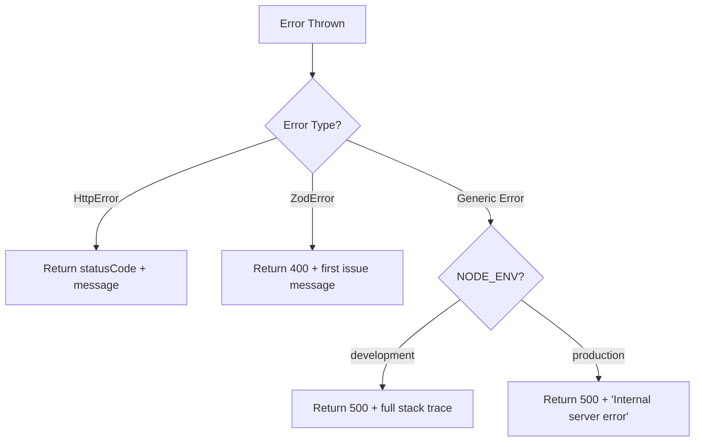

# 15 — Error Handling

## Global Error Handler

All errors flow through the centralized error handler in `Backend/src/middlewares/errorHandler.ts`.

### `HttpError` Class

Custom error class used throughout the application:

```typescript
export class HttpError extends Error {
  statusCode: number;
  constructor(statusCode: number, message: string) {
    super(message);
    this.statusCode = statusCode;
  }
}
```

### Error Handler Middleware

The global error handler processes three types of errors:



### Response Format

All error responses follow this structure:

```json
{
  "ok": false,
  "error": {
    "message": "Human-readable error message"
  }
}
```

### Error Type Handling

| Error Type | Status | Response |
|-----------|--------|----------|
| `HttpError(400, "Invalid dates")` | 400 | `{ ok: false, error: { message: "Invalid dates" } }` |
| `HttpError(401, "Unauthorized")` | 401 | `{ ok: false, error: { message: "Unauthorized" } }` |
| `HttpError(403, "Forbidden")` | 403 | `{ ok: false, error: { message: "Forbidden" } }` |
| `HttpError(404, "Not found")` | 404 | `{ ok: false, error: { message: "Not found" } }` |
| `HttpError(409, "Email exists")` | 409 | `{ ok: false, error: { message: "Email exists" } }` |
| `HttpError(502, "eZee failure")` | 502 | `{ ok: false, error: { message: "eZee failure" } }` |
| `ZodError` | 400 | `{ ok: false, error: { message: "<first validation issue>" } }` |
| `TypeError` (unhandled) | 500 | `{ ok: false, error: { message: "Internal server error" } }` |

---

## Async Error Propagation

### `asyncHandler` Wrapper

All controller handlers are wrapped in `asyncHandler` to catch promise rejections:

```typescript
export const asyncHandler =
  <TReq extends Request>(
    fn: (req: TReq, res: Response, next: NextFunction) => Promise<unknown>
  ) =>
  (req: TReq, res: Response, next: NextFunction) => {
    Promise.resolve(fn(req, res, next)).catch(next);
  };
```

Usage in controllers:

```typescript
router.get("/rooms", asyncHandler(async (req, res) => {
  // Any thrown error or rejected promise → errorHandler
}));
```

---

## 404 Not Found Handler

Defined in `Backend/src/middlewares/notFoundHandler.ts`:

```typescript
export const notFoundHandler = (_req: Request, _res: Response, next: NextFunction) => {
  next(new HttpError(404, `Route not found: ${_req.method} ${_req.originalUrl}`));
};
```

Placed after all route definitions, before the error handler.

---

## Service-Level Error Handling

Services throw `HttpError` instances for business logic violations:

| Service | Error | HTTP Code |
|---------|-------|-----------|
| `authService.login` | Invalid credentials | 401 |
| `authService.signup` | Email already registered | 409 |
| `bookingService.createBooking` | Check-in must be today or future | 400 |
| `bookingService.createBooking` | Check-out must be after check-in | 400 |
| `bookingService.createBooking` | Room not available | 400 |
| `bookingService.markPaymentVerified` | Invalid Razorpay signature | 400 |
| `bookingService.markPaymentVerified` | Booking ownership violation | 403 |
| `promoService.validateForBaseAmount` | Invalid Promocode | 400 |
| `promoService.validateForBaseAmount` | Weekend-only restriction | 400 |
| `ezeeService.fetchRoomList` | eZee configuration missing | 500 |
| `ezeeService.fetchRoomList` | eZee API failure | 502 |
| `adminService.createManualBooking` | eZee InsertBooking failure | 500 |

---

## Email Error Handling

The mailer uses a **silent failure** pattern — errors are logged but never thrown:

```typescript
// mailer.ts
try {
  await transporter.sendMail(mailOptions);
} catch (err) {
  console.error("MAILER ERROR >>>", err);
  // Does NOT throw — booking still succeeds
}
```

This ensures email failures don't prevent booking confirmations.

---

## Admin Server Error Handling

The Admin server (`Admin/src/server.ts`) adds an extra logging middleware before the shared error handler:

```typescript
app.use((err, _req, _res, next) => {
  console.error("Admin backend error:", err instanceof Error ? err.stack || err.message : String(err));
  next(err);
});
app.use(errorHandler); // Shared from Backend
```

---

## Frontend Error Handling

### API Errors
Axios errors are caught in try/catch blocks within page components. Error messages from the `error.message` field in API responses are shown via toast notifications.

### React Error Boundaries
No explicit error boundaries are implemented. Unhandled React errors will show the default white screen.

### Loading States
Pages implement loading states while API calls are in progress, typically showing skeleton or spinner UI.
