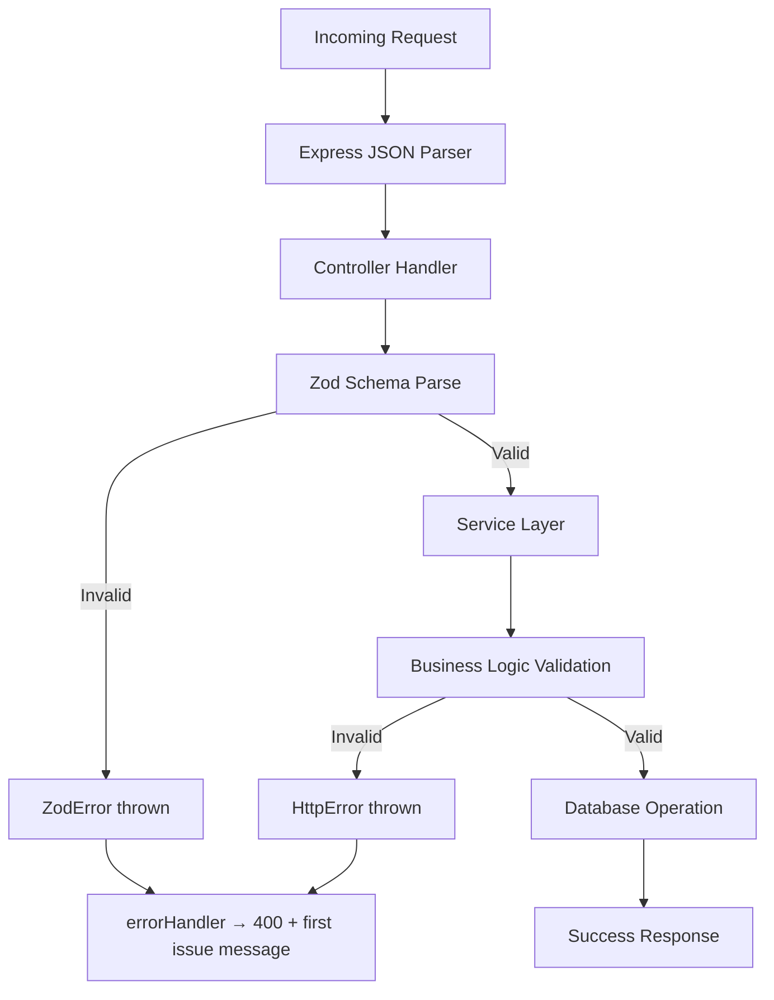

# 17 — Validation

## Overview

The project uses **Zod** for runtime validation on both the backend (request body parsing) and the configuration layer (environment variable validation). The frontend uses Zod via `react-hook-form` with `@hookform/resolvers`.

---

## Backend Validation Schemas

### Auth Schemas (`authController.ts`)

#### Signup Schema
```typescript
const signupSchema = z.object({
  name: z.string().min(1),
  email: z.string().email(),
  password: z.string().min(6),
  phone: z.string().optional(),
});
```

#### Login Schema
```typescript
const loginSchema = z.object({
  email: z.string().email(),
  password: z.string().min(1),
});
```

#### Forgot Password Schema
```typescript
const forgotSchema = z.object({
  email: z.string().email(),
});
```

#### Reset Password Schema
```typescript
const resetSchema = z.object({
  token: z.string().min(1),
  newPassword: z.string().min(6),
});
```

#### Update Profile Schema
```typescript
const updateProfileSchema = z.object({
  name: z.string().min(1).optional(),
  phone: z.string().optional(),
  password: z.string().min(6).optional(),
});
```

---

### Booking Schemas (`bookingController.ts`)

#### Create Booking Schema
```typescript
const createSchema = z.object({
  roomId: z.number().int().positive(),
  checkIn: z.string(),
  checkOut: z.string(),
  checkInTime: z.string().max(5).optional().nullable(),
  checkOutTime: z.string().max(5).optional().nullable(),
  rooms: z.number().int().min(1).max(10).optional(),
  guests: z.number().int().positive(),
  adults: z.number().int().min(0).optional(),
  children: z.number().int().min(0).optional(),
  extraAdults: z.number().int().min(0).optional(),
  additionalInformation: z.string().max(500).optional().nullable(),
  promoCode: z.string().max(50).optional().nullable(),
  mealPlanByDate: z.array(z.object({
    date: z.string(),
    plan: z.enum(["EP", "CP", "MAP"]),
  })).optional(),
  totalAmount: z.number().optional(),
});
```

#### Verify Payment Schema
```typescript
const verifySchema = z.object({
  razorpayOrderId: z.string().min(1),
  razorpayPaymentId: z.string().min(1),
  razorpaySignature: z.string().min(1),
});
```

---

### Environment Variable Schema (`config/env.ts`)

```typescript
const envSchema = z.object({
  PORT: z.coerce.number().default(5050),
  NODE_ENV: z.string().default("development"),
  CLIENT_URL: z.string().default("http://localhost:8080"),
  DATABASE_URL: z.string().min(1),
  JWT_SECRET: z.string().min(16),
  JWT_EXPIRES_IN: z.string().default("7d"),
  JWT_COOKIE_NAME: z.string().default("token"),
  COOKIE_SECURE: z.preprocess(val => val === "true" || val === true, z.boolean().default(false)),
  RAZORPAY_KEY_ID: z.string().optional(),
  RAZORPAY_KEY_SECRET: z.string().optional(),
  // ... SMTP, Gmail, Google OAuth, eZee vars (all optional)
  RESET_TOKEN_EXPIRES_MINUTES: z.coerce.number().default(30),
  EZEE_ALLOW_MISSING_BOOKING_IDS: z.preprocess(
    val => val === "true" || val === true,
    z.boolean().default(false)
  ),
});
```

**Key features**:
- `z.coerce.number()` — Parses string env vars to numbers
- `z.preprocess()` — Handles boolean-like strings (`"true"` / `"false"`)
- `.default()` — Provides sensible defaults for optional vars
- `.min(16)` on JWT_SECRET — Enforces minimum key length

**Validation runs at import time** — if validation fails, the server crashes with a descriptive error before handling any requests.

---

## Service-Level Validation

Beyond Zod schemas, services perform additional business validation:

### Date Validation
```typescript
// bookingService.ts
const checkInDate = new Date(params.checkIn);
const checkOutDate = new Date(params.checkOut);
if (!Number.isFinite(checkInDate.getTime())) throw new HttpError(400, "Invalid dates");
if (inDay.getTime() < today.getTime()) throw new HttpError(400, "Check-in must be today or future");
if (ms <= 0) throw new HttpError(400, "Check-out must be after check-in");
```

### eZee API Input Validation
```typescript
// ezee.service.ts
const checkIn = toIsoDateOnly(params.checkIn); // Validates YYYY-MM-DD format
if (!checkIn || !checkOut) throw new HttpError(400, "DateNotvalid");
if (nights > 30) throw new HttpError(400, "NightsLimitExceeded");
if (adults < 1) throw new HttpError(400, "adults must be >= 1");
```

### Promo Code Validation
```typescript
// promoService.ts
if (!promo) throw new HttpError(400, "Invalid Promocode");
if (!promo.isActive) throw new HttpError(400, "Invalid Promocode");
if (promo.startsAt && now < promo.startsAt) throw new HttpError(400, "Invalid Promocode");
if (promo.maxUses != null && usedCount >= maxUses) throw new HttpError(400, "Invalid Promocode");
if (promo.minNights != null && nights < promo.minNights) throw new HttpError(400, "Minimum nights");
```

---

## Validation Flow



---

## Error Messages for Validation Failures

Zod validation errors are formatted as the **first issue message** only:

```typescript
if (err instanceof ZodError) {
  const msg = err.issues?.[0]?.message ?? "Validation error";
  res.status(400).json({ ok: false, error: { message: msg } });
}
```

This means clients receive a single, human-readable error message rather than the full Zod issue array.

---

## Frontend Validation

### Form Validation
Frontend forms use a combination of:
- HTML5 `required` attributes
- React state-based validation in `onChange` handlers
- Zod schemas with `react-hook-form` (via `@hookform/resolvers`)

### Client-Side Checks
- Date validation (check-in before check-out)
- Guest count validation (positive numbers)
- Email format validation
- Password minimum length

All client-side validation is supplementary — the backend performs authoritative validation on every request.
