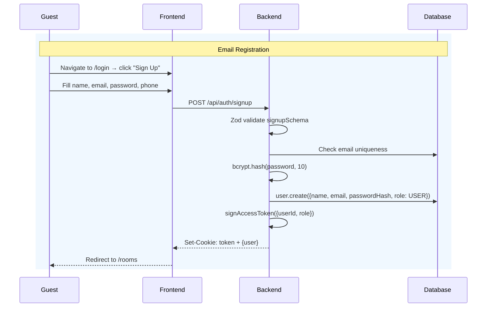
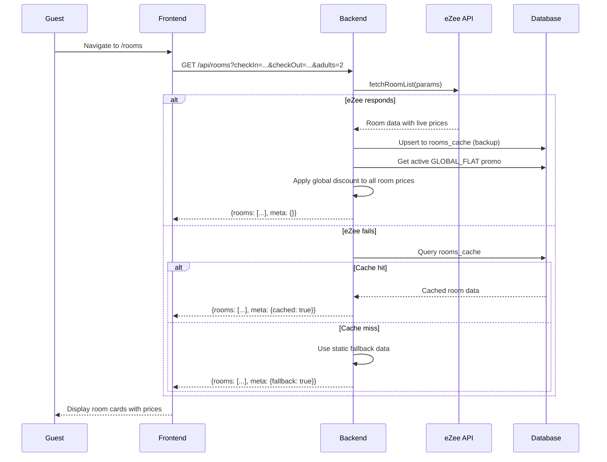
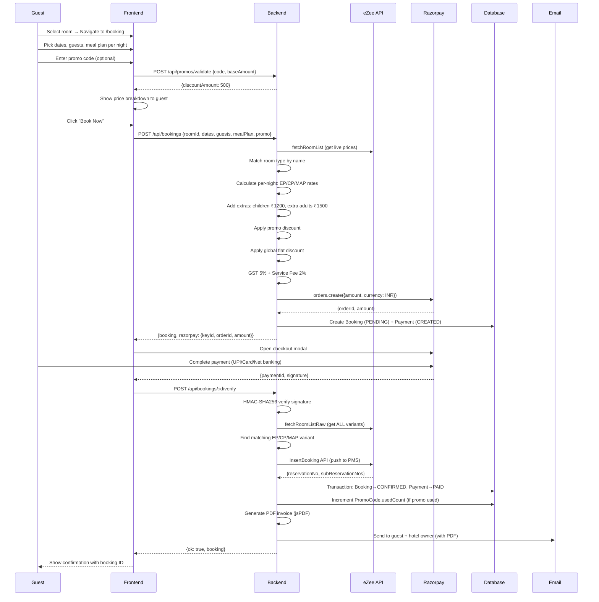
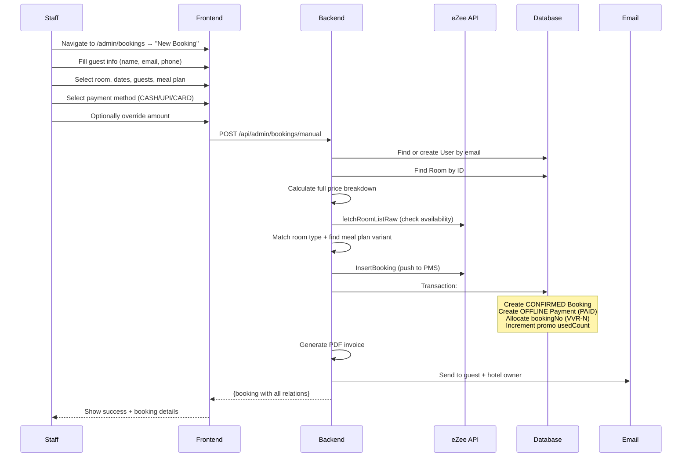
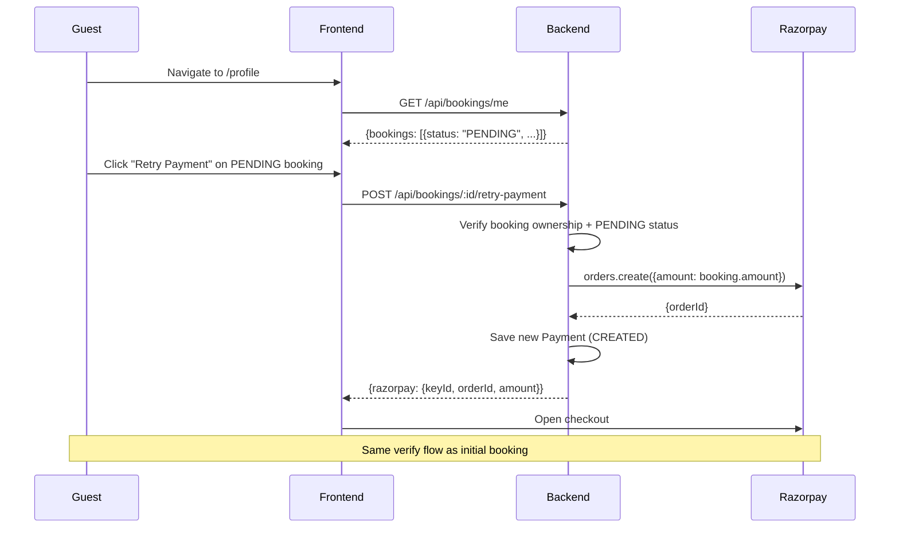
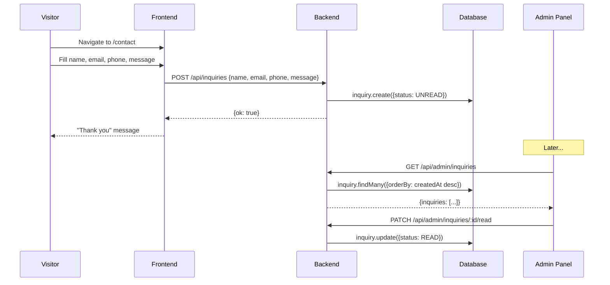
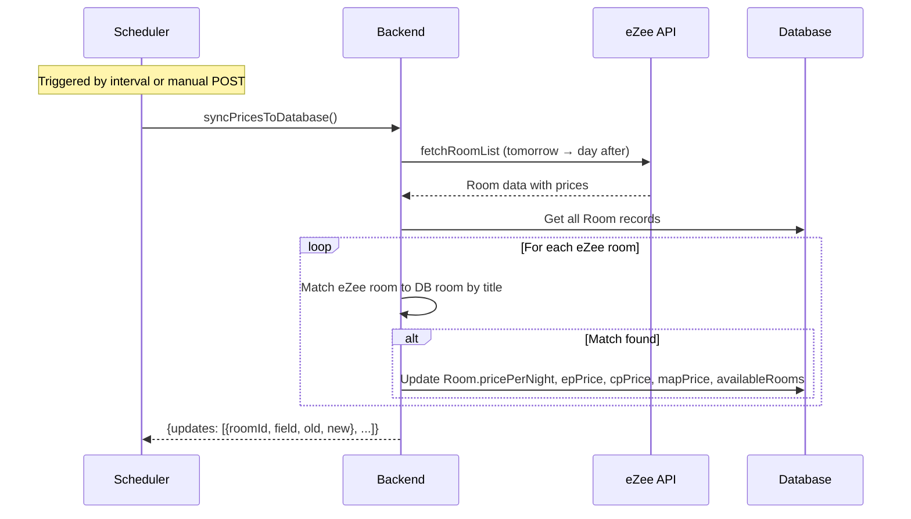

# 18 — Project Workflow

## End-to-End Application Flows

### 1. Guest Registration & Login

### 2. Room Browsing with Live Prices

### 3. Complete Booking Flow

### 4. Admin Manual Booking

### 5. Payment Retry Flow

### 6. Inquiry Submission

### 7. Price Sync Workflow

